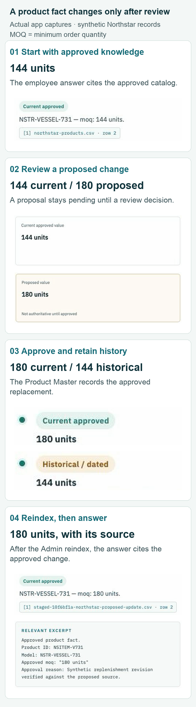
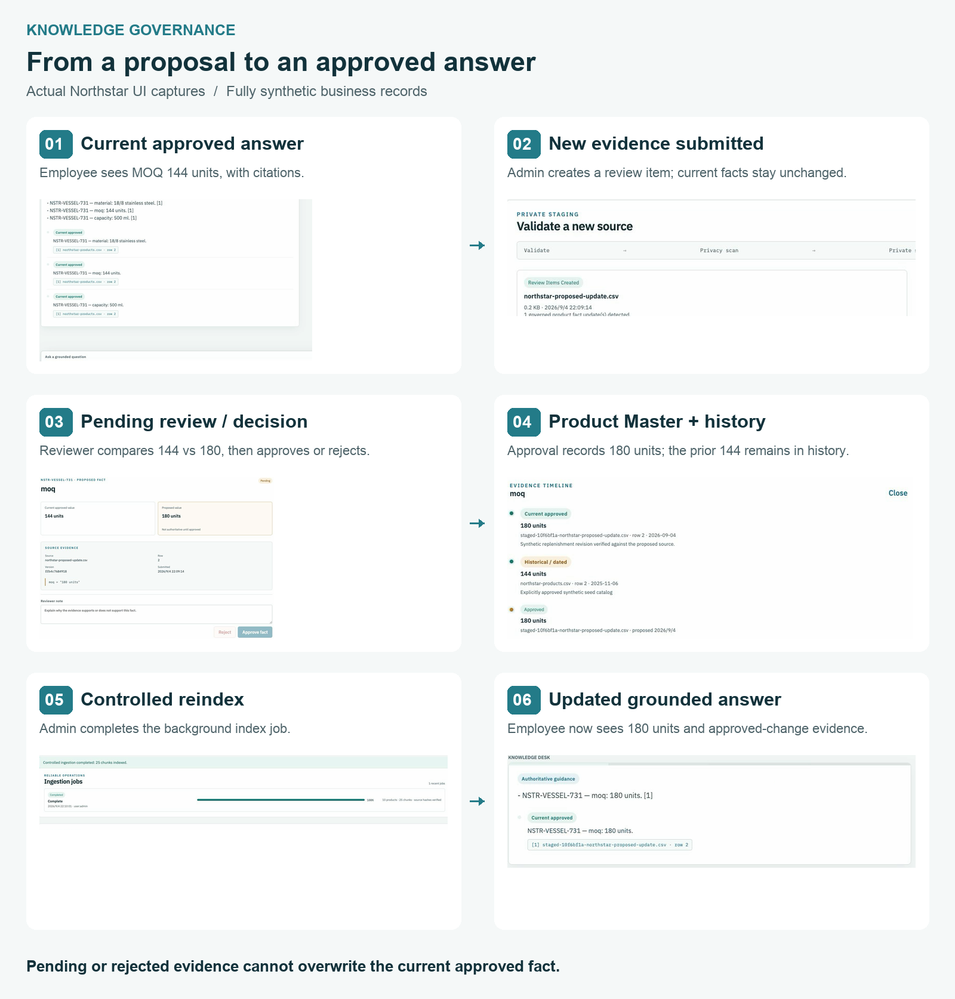
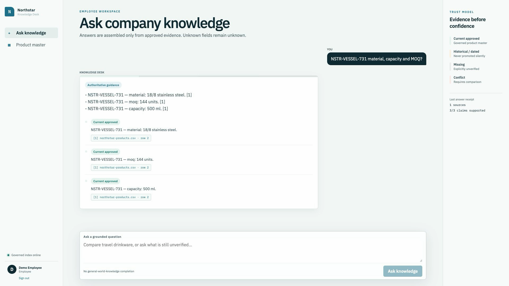
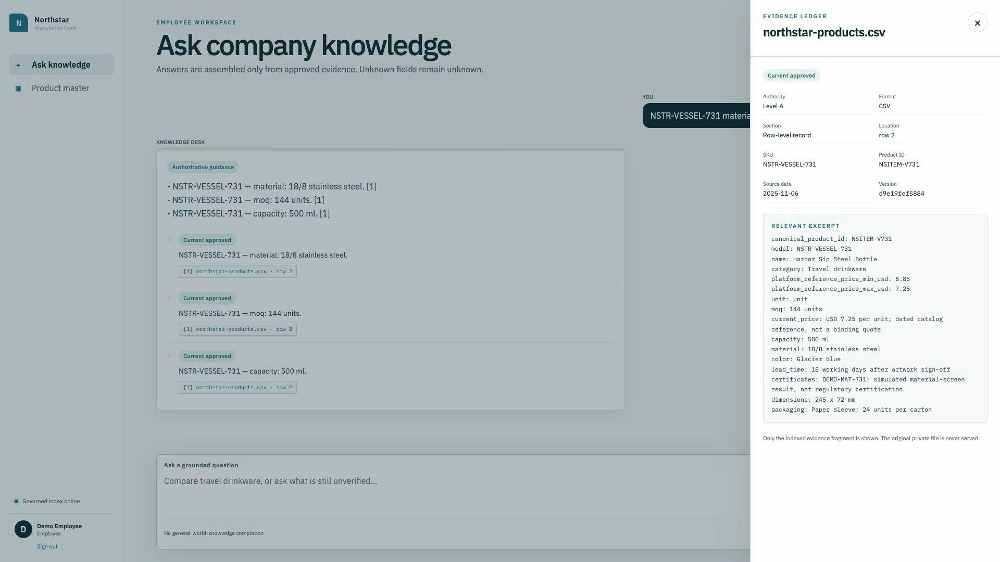
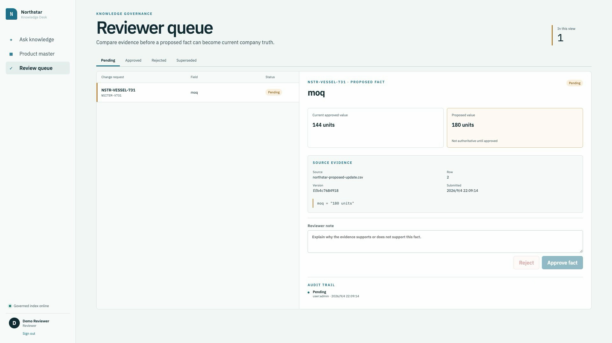
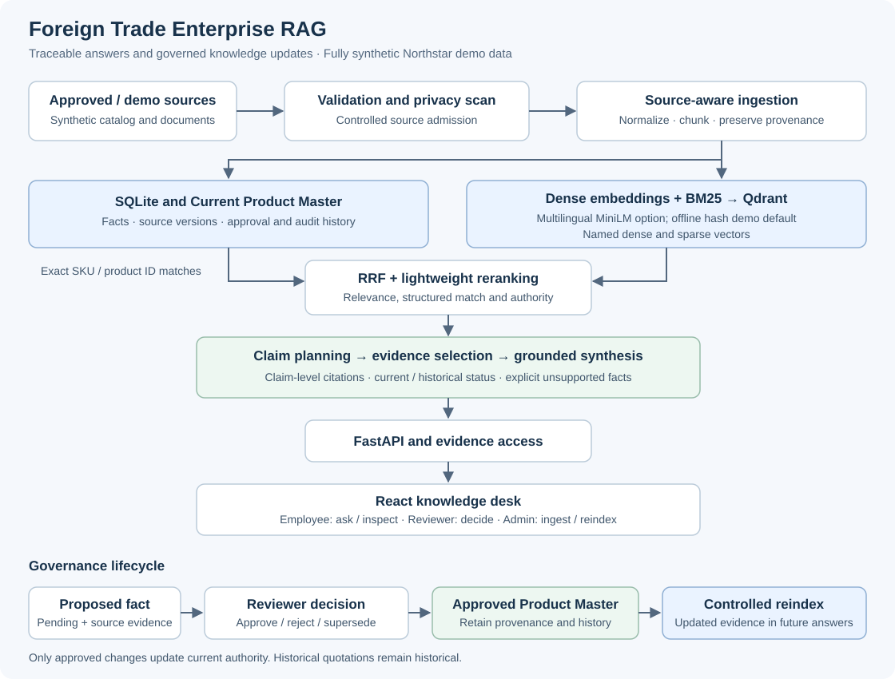
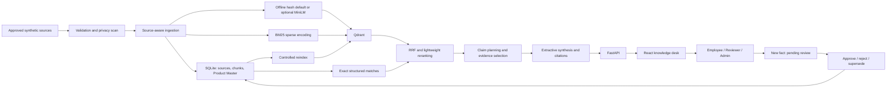

# Foreign Trade Enterprise RAG

[中文概览](README.zh-CN.md)

**Which product fact is approved—and where did it come from?**

Foreign-trade teams need to find product and policy information across catalogs, operating instructions and old quotations. This prototype shows the sources behind answers and reviews proposed changes before they become current facts.

**The example:** a product's minimum order quantity (MOQ) moves through four visible stages: **approved 144 → pending proposal 180 → approved 180 with 144 retained as history → reindexed answer citing 180**. Pending or rejected evidence cannot silently replace the approved value.

**Synthetic public prototype:** fictional Northstar records, actual application captures; no live cloud deployment.

**[Watch / download the 2:36 demo](docs/demo/enterprise-rag-demo.mp4)** · [Portfolio case](https://hql7-luo.github.io/projects/foreign-trade-enterprise-rag.html) · [Technical details](#rag-pipeline)

## Four stages, from existing fact to approved answer



The second, third and fourth panels combine tightly cropped regions of original captures with white spacing. Captions sit outside the captured UI. [Full frames, exact crops and source hashes](docs/demo/governance-visual.md).

## Why this matters

Before using an answer, a team can inspect what is current, what is historical, what is missing and why a change was approved. This is a demonstrated information-management workflow; time savings, revenue gains and real-company performance have not been measured.

## My contribution and skills shown

I defined the fragmented-information problem and the requirements for retrieval, source citations and business information management, and participated in feature iterations, evaluation and result checking. **Codex and Claude substantially assisted implementation, tests and docs.**

**Project methods:** business process design · information systems · retrieval with inspectable evidence · approval workflows · evaluation and its limitations.<br>
**My confirmed contribution:** problem framing · requirements definition · feature iteration · result review.

The technical stack below describes the artifact; I am not claiming independent coding or test execution.

<details>
<summary>Inspect the full six-step workflow, including source staging and Admin reindex</summary>

<picture>
  <source media="(max-width:600px)" srcset="docs/demo/governance-workflow-mobile.png">
  
</picture>

Read **01 → 06**: approved answer → source staging → pending comparison and review decision → Product Master history → controlled reindex → updated cited answer. Approval and reindex are separate operations; the four-stage overview groups them for easier reading.

</details>

[v1.0.0 release](https://github.com/hql7-luo/foreign-trade-enterprise-rag/releases/tag/v1.0.0) · [CI validation](https://github.com/hql7-luo/foreign-trade-enterprise-rag/actions) · [Publication record](docs/github_publication.md)

## Demo

**[Watch / download the 2:36 demo MP4](docs/demo/enterprise-rag-demo.mp4)** · 1080p, silent, actual browser interactions.

The [demo script](docs/demo_script.md) uses only fictional Northstar records. Recording verification is described in the [recording runbook](docs/demo/recording_runbook.md). No paid cloud deployment is running and no live URL is claimed.

<details>
<summary>Inspect full-size answer, evidence and pending-review screenshots</summary>





</details>

## Architecture



<details>
<summary>Mermaid diagram source and interactive rendering</summary>


```mermaid
flowchart LR
    S[Approved synthetic sources] --> V[Validation and privacy scan]
    V --> I[Source-aware ingestion]
    I --> DB[SQLite: sources, chunks, Product Master]
    I --> E[Offline hash default or optional MiniLM]
    I --> B[BM25 sparse encoding]
    E --> Q[Qdrant]
    B --> Q
    DB --> X[Exact structured matches]
    Q --> R[RRF and lightweight reranking]
    X --> R
    R --> C[Claim planning and evidence selection]
    C --> A[Extractive synthesis and citations]
    A --> API[FastAPI]
    API --> UI[React knowledge desk]
    UI --> U[Employee / Reviewer / Admin]
    U --> P[New fact: pending review]
    P --> D[Approve / reject / supersede]
    D --> DB
    DB --> RE[Controlled reindex]
    RE --> Q
```

</details>

See [architecture and operational boundaries](docs/architecture.md).

## RAG pipeline

Exact SKU / product ID → dense retrieval + BM25 → Reciprocal Rank Fusion → authority-aware lightweight reranking → claim-level grounded synthesis → source citation.

**System stack:** Python / FastAPI · SQL / SQLite · React / TypeScript · Qdrant / BM25 / RRF. RAG here retrieves evidence and assembles an extractive answer; it does not use an answer-generating LLM.

- Qdrant stores named dense and sparse vectors. SQLite retains the authoritative structured records and provenance.
- The optional neural provider is `sentence-transformers/paraphrase-multilingual-MiniLM-L12-v2`, 384 dimensions, through FastEmbed/ONNX.
- The default offline demo uses deterministic 384-dimensional feature hashing. **It is a test/demo fallback, not neural semantic retrieval.** Changing embedding configuration creates a distinct collection fingerprint and requires ingestion.
- Answers are locally composed from explicit evidence fields. No answer-generating LLM or paid API is enabled in this public edition.
- CSV rows remain individual records; Markdown heading sections retain field groups and line provenance. Historical quotations never establish current product facts.

## Knowledge governance

Only the explicit synthetic seed catalog is bootstrapped as approved. Incoming evidence follows `pending → approved / rejected → superseded`; every decision preserves actor, note, timestamp, value and source version.

Approval updates Current Product Master. An Admin then runs controlled reindexing so future answers and their evidence reflect the approved fact. A rejected or pending proposal never overwrites current authority. Duplicate model numbers require a product ID.

## Roles

| Role | Access |
|---|---|
| Employee | Chat, source excerpts, Product Master; no approval or ingestion |
| Reviewer | Employee access plus fact review and audit history |
| Admin | Reviewer access plus source staging, background reindex jobs and diagnostics |

Authentication uses generated passwords with Argon2 hashes and server-side session digests. Browser tokens remain in memory, not localStorage. These are intentionally small demo controls, not an IAM platform.

## Public demo dataset

**All business data in this public repository is fully synthetic and belongs to the fictional Northstar Trading company.**

Ten products cover travel drinkware, organizers, camping lights, desk accessories and carry bags. Five source files include company policy, order procedures, two expired quotations and an invented demand snapshot. A separate update proposes changing one product's MOQ from 144 to 180 units.

Empty fields mean unverified. DEMO-prefixed compliance records are simulated examples, not regulatory certificates. Listing score/exposure fields are explicitly zeroed synthetic compatibility metadata, not measured commercial performance.

## Evaluation

**Synthetic Public Demo Benchmark** — newly authored labels, frozen hashes and immutable first-run artifacts. The three splits were defined before execution. The same development agent authored data and questions: the blind-named set is an internal frozen holdback, **not independently human-authored blind validation**.

All results below use the offline hash provider, BM25 and local Qdrant. They do not estimate real-company accuracy or the quality of the neural embedding provider.

| Split | N | Recall@1 / @3 / @5 / @8 | MRR | Answer | Citation | Claim coverage | Unsupported-field hallucination |
|---|---:|---|---:|---:|---:|---:|---:|
| Development, first run | 30 | 78.33 / 90 / 96.67 / 96.67% | 0.9150 | 96.67% | 96.67% | 94.74% | 0/5 |
| Held-out, first run | 20 | 75 / 95 / 97.5 / 97.5% | 0.8875 | 80% | 85% | 77.27% | 0/3 |
| Internal frozen holdback, first run | 20 | 75 / 90 / 92.5 / 95% | 0.8850 | 85% | 95% | 91.30% | 0/5 |

The **92.5%** figure is mean Recall@5 over the 20 internal frozen holdback questions: coverage of expected sources within the first five retrieved results. It is not answer accuracy, a count of fully correct questions, or independently validated business performance. The optional MiniLM implementation was smoke-checked, not benchmarked for retrieval quality.

Median query latency was 6.41–6.59 ms, P95 7.66–7.74 ms on the local test machine, excluding ingestion and model startup. Source/claim substring checks are automated, not human semantic grading. Citation scores include vacuous passes on questions with no expected supported claim. Zero narrowly detected unsupported-field hallucinations does **not** establish zero semantic errors.

[Metric definitions and review workflow](evaluation/README.md) · [Full first-run results](evaluation/results) · [Failure analysis](docs/benchmark_analysis.md)

## Security & data privacy

This public portfolio edition does not contain proprietary company records, customer information, private quotations or confidential operational data. All included business records were generated solely for demonstration and testing. Public history starts independently; no private Git objects, fixtures or benchmark labels were transferred.

Uploads are bounded, validated, sensitivity-scanned and quarantined. Employee evidence access exposes only indexed excerpts, never raw files. Secrets, runtime databases, vector storage, models and logs are ignored by Git and excluded from Docker build contexts.

[Publication privacy audit](docs/publication_privacy_audit.md) · [Security and operations](docs/security_and_operations.md)

## Quick start

Requirements: Python 3.11+, uv, Node 22.18+ and pnpm 11.19.0. Python 3.11 and 3.12 are tested in CI; the Docker demo uses Python 3.12. Run from the repository root.

```bash
cp .env.example .env
uv sync --frozen --extra dev
uv run python -m scripts.local_demo
```

In another terminal:

```bash
corepack enable
corepack prepare pnpm@11.19.0 --activate
pnpm --dir frontend install --frozen-lockfile
pnpm --dir frontend dev
```

Open `http://localhost:5173`. The backend uses loopback port 8000 and initializes only the packaged Northstar sources. Read `data/public-demo-runtime/demo-credentials.txt` locally for `employee`, `reviewer` and `admin`. **Never commit or show this file in a recording.**

The source catalog is not editable from Employee chat. Follow [the demo script](docs/demo_script.md) to stage and approve a synthetic update. Once the demo has managed uploads, use a fresh isolated runtime for a clean take; strict maintenance checks deliberately refuse unrecognized source families.

## Docker

```bash
docker compose up --build -d --wait
docker compose exec backend python -c "from pathlib import Path; print(Path('/app/data/private/demo-credentials.txt').read_text())"
```

Open `http://localhost:3000`. The second command prints **local generated credentials**; keep it off-screen. Compose starts FastAPI, the built React frontend and Qdrant with persistent named volumes. Only loopback ports are published. A [real GitHub Actions run](https://github.com/hql7-luo/foreign-trade-enterprise-rag/actions/runs/33890245546) passed Docker configuration, clean image builds, stack startup and deployment smoke tests. Do not expose this local Compose file directly to the internet.

## Testing

```bash
uv run pytest -q
uv run ruff check app scripts tests
uv run python -m compileall -q app scripts tests
uv run python -m scripts.verify_public_release
pnpm --dir frontend test
pnpm --dir frontend lint
pnpm --dir frontend build
```

Backend coverage targets ingestion, idempotency, authority, conflicts, approvals, security, sessions, jobs and isolated maintenance. Frontend checks include chat, evidence, reviewer decisions, role navigation, error handling and axe accessibility checks. Automated DOM accessibility checks exclude contrast; browser review is also required.

## Known limitations

- Small, synthetic, developer-authored corpus; no evidence of large-scale or real-company accuracy.
- Partial SKU matching is weak. Vague wording can trigger extra unsupported claims; source selection can confuse different SOP phases.
- A historical request containing unrecognized wording can be answered in the wrong scope. Inspect date and source status; do not use the demo for commercial decisions.
- Single worker and local SQLite; index rebuild is a maintenance operation, not zero-downtime distributed indexing.
- Upload-to-fact mapping supports controlled CSV proposals. Other allowed formats receive bounded previews, not automatic authoritative ingestion.
- No cloud deployment, enterprise SSO, independent penetration test or externally reviewed benchmark.
- No open-source license has been selected yet. Public visibility alone does not grant redistribution rights.

## Deployment readiness

Production-oriented configuration exists: environment validation, optional neural embeddings, read-only public mode, limits, structured logs, readiness, persistent storage and operator backup/reset tools. HTTPS/domain provisioning and runtime validation remain operator responsibilities. **No paid production deployment is running.**

See [public release status](docs/public_portfolio_release.md), [architecture](docs/architecture.md), and [benchmark failure analysis](docs/benchmark_analysis.md). The contribution statement above reflects the confirmed AI-assisted division of work.
