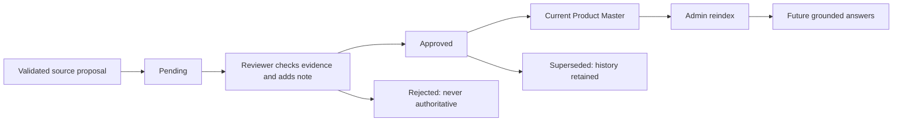

# Architecture and decisions

FastAPI owns authorization, grounded queries, evidence, source staging and review APIs. React
separates employee work from reviewer/admin actions. SQLite owns sources, indexed chunks,
product identities, approved field values, proposals, decisions and durable jobs. Qdrant is
a rebuildable index, not the authority for business facts.

## Evidence flow

1. The allowlisted synthetic sources pass schema and sensitivity validation.
2. Product CSV rows preserve row numbers. Markdown heading blocks preserve sections and
   line ranges; quotation terms stay grouped with their product and date.
3. Current facts enter a governed master. Changed source values generate pending proposals.
4. Named dense and BM25 sparse vectors are indexed in Qdrant. Embedding fingerprints separate
   incompatible configurations; a mismatched index fails with an ingestion instruction.
5. Exact matches, dense results and keyword results are fused using RRF and lightweight authority
   signals. Open discovery can return several products; exact identifiers are not diversified.
6. Schema-led claim planning maps requested fields to evidence. Current facts require approved
   entity-scoped support. Missing fields stay unsupported. Historical claims remain dated.
7. Each supported claim gets its own evidence pointer. Raw files are never served by URL.

## Governance flow

Bootstrap approval is limited to the explicitly packaged synthetic catalog. Uploaded sources
are never automatically authoritative. Historical quotation evidence cannot be promoted into
current product truth through the approval API. Multiple records sharing a SKU require an ID.

## Scope and tradeoffs

The engineering layers were reused only after inspection. Source-specific parsers, domain
examples, answer adapters, tests, labels and documents were replaced with public-only versions.
This is an independent edition, not a sanitized branch or a claim of identical behavior.

No answer-generating LLM is enabled; the local extractive composer makes support inspectable.
The real multilingual MiniLM provider is configurable and independently smoke-tested. Offline
demo benchmarks use deterministic hashing instead, explicitly labeled as non-neural.

One-process SQLite and a rebuildable local/server Qdrant keep the project understandable.
Production concurrency, atomic index swaps, identity federation and external benchmark review
are future requirements, not demonstrated capabilities.
